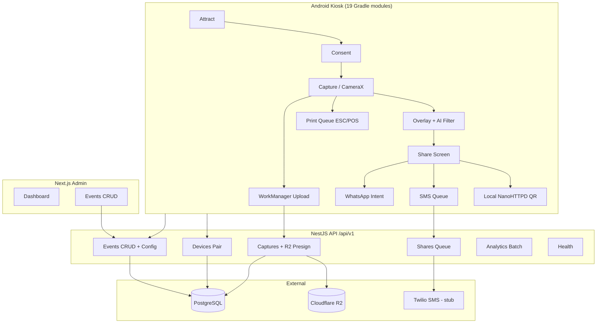

# Architecture Report

## System Overview



## Repository Structure

| Layer | Path | Technology |
|-------|------|------------|
| Android app | `app/`, `feature/*`, `core/*`, `hardware/*`, `kiosk/` | Kotlin, Compose, Hilt, Room+SQLCipher, CameraX, WorkManager |
| Backend | `backend/src/` | NestJS 10, TypeORM, PostgreSQL, AWS SDK (R2) |
| Admin | `admin-dashboard/src/` | Next.js 14 App Router |
| Docs | `docs/` | Architecture, API, schema, deployment |

**Android modules (19):** `app`, `kiosk`, 5× `core`, 9× `feature`, 2× `hardware`

## Frontend Flow (Kiosk)

1. **Boot** → `BootReceiver` launches `MainActivity` → Lock Task mode
2. **Attract** → 5-tap title opens admin (PIN `1234`)
3. **Consent** → session consent stored in Room
4. **Capture** → CameraX → `CaptureResult` → `MainViewModel.processCapture`
   - Photo: beauty filter → layout compositor → save → print enqueue → upload
   - GIF/Boomerang: raw path only (encoder placeholder)
5. **Share** → QR (LAN HTTP) + SMS phone field + WhatsApp/Email intents
6. **Reset** → navigate to Attract

## Backend Flow

| Endpoint | Auth | Purpose |
|----------|------|---------|
| `POST /devices/pair` | Pairing code | Issue device token |
| `GET /events/:id/config` | None | Kiosk pulls event theme/templates |
| `GET/POST /events` | Admin API key | Admin CRUD |
| `GET /events/:id/stats` | Admin API key | Capture/share counts |
| `POST /captures` | Bearer device token | Create + presign R2 PUT |
| `POST /captures/:id/complete` | Bearer | Finalize upload |
| `POST /shares` | Bearer | Queue SMS/share |
| `POST /analytics/batch` | Bearer | Device telemetry |
| `GET /health` | None | Liveness |

## Database Relationships

```
events (1) ──< captures (N) ──< shares (N)
devices (1) ──< captures (N)
devices (1) ──< analytics_events (N)
```

See `docs/DATABASE_SCHEMA.md` for field-level detail.

## External Integrations

| Service | Status | Usage |
|---------|--------|-------|
| PostgreSQL | Required | Primary datastore |
| Cloudflare R2 | Required for cloud backup | Presigned PUT uploads |
| Twilio SMS | **Stub** | Env vars documented; no SDK call |
| Local HTTP | Active | QR download on LAN |
| WhatsApp/Email | Active | Android share intents |

## AI Services

- **On-device only:** TFLite/GPUImage beauty filter (`FilterPreset.BEAUTY`)
- **No cloud AI** (Fal.ai etc.) per MVP scope

## Authentication Flows

| Actor | Mechanism | Gap |
|-------|-----------|-----|
| Kiosk device | Pairing code → UUID bearer token | No pairing UI; token stored locally |
| Admin API | `x-admin-api-key` header | No login UI; key in server env |
| Event config | **Public** by event UUID | Should require device token |
| Kiosk admin | PIN overlay | Hardcoded `1234` |

## Image Processing Pipeline

```
CameraX JPEG → BitmapFactory → FilterProcessor (GPUImage/TFLite)
  → LayoutCompositor (template overlay) → composite JPEG
  → LocalMediaServer register → PrintQueue → UploadWorker → R2
```

## Deployment Configuration

- **Android:** Product flavors `dev` / `staging` / `prod` with BuildConfig API URLs
- **Backend:** Node process, env-driven; no Docker/CI in repo (`.github/workflows/build.yml` exists for Android)
- **Admin:** Vercel-compatible Next.js static/SSR hybrid

## Architecture Strengths

- Clear feature-module boundaries on Android
- Idempotency keys on captures/shares
- Offline-first queue with WorkManager
- Presigned direct-to-R2 uploads (no backend blob proxy)

## Architecture Risks

- No schema migrations → prod deploy risk
- Single-process NestJS without job queue for SMS
- Event config pull not wired from kiosk to server
- No tenant isolation (acceptable for wedding MVP)
