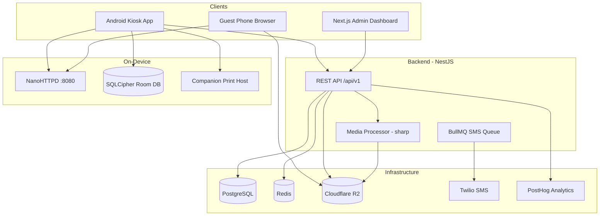

# Product Audit — Master Index

**Project:** Wedding Photobooth MVP  
**Audit Date:** June 10, 2026  
**Auditor Role:** Principal PM · UX Architect · QA · Technical Architect · Growth Strategist  
**Scope:** Full codebase — Android, Backend, Admin Dashboard, Companion Host  
**Code Changes:** None (read-only audit)

---

## Purpose

This audit documents **everything that exists today** before any new feature work. It maps screens, flows, APIs, features, gaps, risks, and a prioritized roadmap.

---

## Report Index

| # | Report | Contents |
|---|--------|----------|
| — | [MASTER_REPORT.md](./MASTER_REPORT.md) | Single comprehensive deliverable (all 18 sections) |
| 01 | [01_EXECUTIVE_SUMMARY.md](./01_EXECUTIVE_SUMMARY.md) | Executive summary, product overview, discovery status |
| 02 | [02_FEATURES.md](./02_FEATURES.md) | Complete feature inventory by category |
| 03 | [03_SCREENS.md](./03_SCREENS.md) | Screen inventory — Android + Admin |
| 04 | [04_USER_FLOWS.md](./04_USER_FLOWS.md) | User journey maps and flow diagrams |
| 05 | [05_ARCHITECTURE.md](./05_ARCHITECTURE.md) | System architecture, components, integrations |
| 06 | [06_DATABASE_API.md](./06_DATABASE_API.md) | Database schema, API catalog, auth, data flow |
| 07 | [07_UX_AUDIT.md](./07_UX_AUDIT.md) | UX friction, journey scores, accessibility |
| 08 | [08_UI_AUDIT.md](./08_UI_AUDIT.md) | Visual design, consistency, responsiveness |
| 09 | [09_PERFORMANCE.md](./09_PERFORMANCE.md) | Frontend, backend, Android performance |
| 10 | [10_SECURITY.md](./10_SECURITY.md) | Auth, secrets, risks, compliance gaps |
| 11 | [11_BUSINESS.md](./11_BUSINESS.md) | Business model, audience, competitive analysis |
| 12 | [12_ROADMAP.md](./12_ROADMAP.md) | Quick wins → strategic improvements, tech debt, next sprint |

---

## Prior Audit Cross-Reference

Earlier engineering audits live in `docs/audits/` (June 7–8, 2026). This product audit **supersedes and extends** those findings with:

- Complete screen and flow inventory
- Business and competitive analysis (previously absent)
- Updated status reflecting recent fixes (consent flow, migrations, gallery pagination, etc.)
- Prioritized product roadmap with impact/effort scoring

| Prior Doc | Relationship |
|-----------|--------------|
| `docs/audits/00_EXECUTIVE_SUMMARY.md` | Baseline scores; see MASTER_REPORT for updated assessment |
| `docs/FIELD_TEST_CHECKLIST.md` | QA validation checklist (some items aspirational) |
| `docs/AGENT_LOCAL_SETUP_GUIDE.md` | Developer onboarding (not operator onboarding) |
| `docs/REALITY_REPORT.md` | Post-fix verification state |

---

## System at a Glance

---

## Production Readiness Snapshot

| Dimension | Score | Status |
|-----------|-------|--------|
| Architecture | 72/100 | ✅ Solid modular design |
| Feature Completeness | 58/100 | ⚠️ Core loop works; many partial |
| UX | 58/100 | ⚠️ Guest flow OK; admin thin |
| Security | 48/100 | ❌ Critical gaps remain |
| Test Coverage | ~15/100 | ❌ Minimal automated tests |
| Business Readiness | 35/100 | ❌ No monetization, no GTM |
| **Overall** | **54/100** | **Private beta only** |

**Verdict:** Field-test ready with on-site engineer. Not commercially launch-ready.

---

## What Does NOT Exist

| Area | Status |
|------|--------|
| Payment / Stripe | ❌ Not implemented (future Phase 2) |
| Email share worker | ❌ Queue registered, no worker |
| WhatsApp share worker | ❌ Queue registered, no worker |
| Push notifications | ❌ Not implemented |
| Multi-tenant SaaS | ❌ Tenant hardcoded `"default"` |
| Guest web app (capture) | ❌ Gallery only |
| AI image generation | ❌ Beauty filter only (CPU blur stub) |
| DSLR tether | ❌ Deferred |
| Role-based admin access | ❌ Binary API key only |

---

*Next step: Read [MASTER_REPORT.md](./MASTER_REPORT.md) for the full narrative, or drill into individual reports above.*
