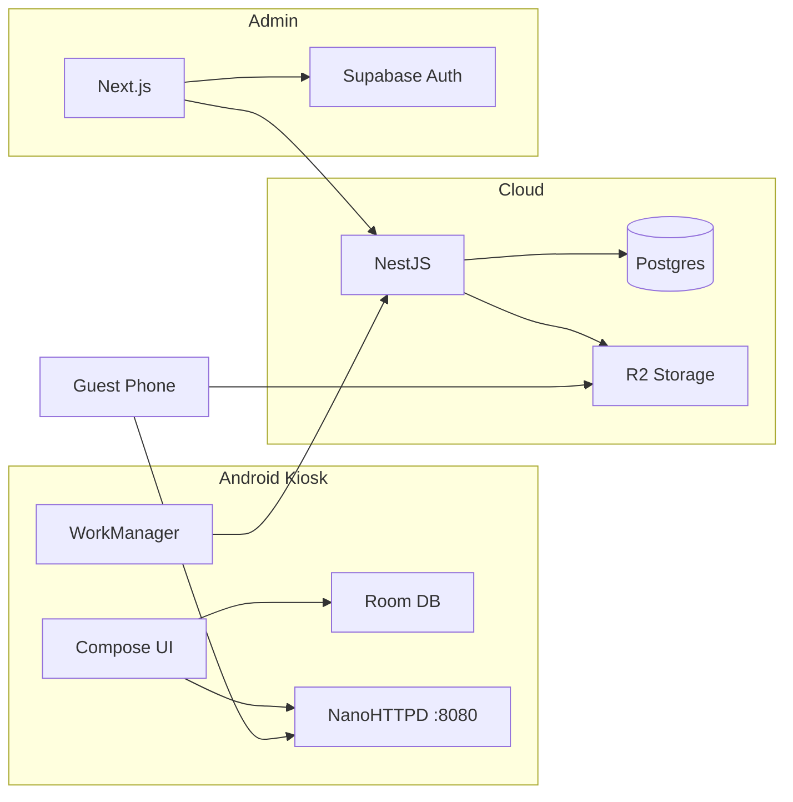

# Executive Summary & Product Overview

## 1. Executive Summary

**Wedding Photobooth** is an offline-first, Android-native wedding photobooth platform with a NestJS cloud backend, Next.js operator admin, and Cloudflare R2 media storage. It targets luxury wedding operators who deploy a locked-down tablet kiosk at venues.

### What Works Today

The **core guest loop is functional** after recent fixes:

> Pair → Attract → Consent → Capture (Photo/GIF/Boomerang) → Beauty filter + template overlay → Share (local QR / SMS queue / WhatsApp/Email intents) → Return to attract

Operators can create events in admin, pair devices, publish token-gated galleries, and monitor device last-seen. Offline capture with local QR sharing works without cloud connectivity.

### What Blocks Commercial Launch

1. **Security score 48/100** — admin API key bypass if env unset; plaintext device tokens; low gallery token entropy
2. **Background sync reliability** — WorkManager Hilt worker instantiation issues may block uploads
3. **No automated test coverage** at scale (~28 backend unit tests; minimal Android/admin E2E)
4. **No payment, subscription, or billing** infrastructure
5. **Partial features presented as complete** — analytics page, email/WhatsApp workers, capture thumbnails in admin
6. **No operator onboarding** — only developer setup docs exist

### Recommendation

Proceed with **private beta (1–3 weddings)** with an on-site engineer. Do not sell as self-serve SaaS until security hardening, test coverage, and background sync are resolved.

---

## 2. Product Overview

### Problem Solved

Wedding guests want instant, branded photo memories shared digitally and physically printed — without waiting for a professional photographer. Operators need a reliable, lockable kiosk that works on venue Wi-Fi (or offline) and syncs to a cloud gallery.

### Target Audience

| Segment | Fit | Notes |
|---------|-----|-------|
| Luxury wedding operators | **Primary** | Single-booth, attendant-present model |
| Kerala traditional weddings | **Strong** | `kerala_traditional` theme stub exists |
| Corporate / exhibition | **Not ready** | Multi-booth, branding immature |
| Self-serve rental | **Not ready** | Requires MDM provisioning + remote ops |

### Core Value Proposition

> *"Branded, offline-resilient wedding photobooth that guests love — with instant QR sharing, optional prints, and a live operator dashboard."*

### Technology Stack

| Layer | Technology |
|-------|------------|
| Android Kiosk | Kotlin, Jetpack Compose, Hilt, Room (SQLCipher), CameraX, WorkManager, NanoHTTPD |
| Backend | NestJS 10, TypeORM, PostgreSQL, BullMQ, Redis, sharp, Twilio |
| Admin | Next.js 14 App Router, Tailwind, Framer Motion, GSAP, Supabase Auth |
| Storage | Cloudflare R2 (S3-compatible) |
| Analytics | PostHog (backend + admin client) |
| Print | Companion host (Python ThreadingHTTPServer on Raspberry Pi) + ESC/POS |
| AI | GPT-4o-mini (admin consent/hashtag generation only) |

### Repository Structure

```
wedding-photobooth/
├── app/              # Android shell, navigation, DI
├── core/             # domain, data, database, network, designsystem
├── feature/          # attract, consent, capture, overlay, ai, printing, sharing, sync, admin
├── hardware/         # CameraX, ESC/POS printer drivers
├── kiosk/            # Device Owner, Lock Task, boot receiver
├── backend/          # NestJS API
├── admin-dashboard/  # Next.js operator UI
├── companion-host/   # Pi print server
└── docs/             # Setup, audits, runbooks
```

---

## 3. Phase 1 — Application Discovery Summary

### Component Status Matrix

| Component | Purpose | Status |
|-----------|---------|--------|
| **Android Kiosk** | Guest capture + share + offline | ✅ Working (sync caveats) |
| **Admin Dashboard** | Event/device management | ⚠️ Partial (no edit/delete, thin analytics) |
| **Backend API** | Cloud sync, gallery, SMS | ✅ Working (email/WA missing) |
| **PostgreSQL** | Persistent data | ✅ Working, 5 tables, 5 migrations |
| **Redis / BullMQ** | SMS queue | ✅ Working |
| **Cloudflare R2** | Media storage | ✅ Working (needs real creds) |
| **Twilio SMS** | Outbound MMS/SMS | ⚠️ Implemented; needs live creds |
| **Local QR Server** | Offline guest download | ✅ Working (HMAC, 15min TTL) |
| **Companion Print** | DNP via Pi | ⚠️ Implemented; needs hardware test |
| **Supabase Auth** | Admin login | ⚠️ Optional; bypassed if unconfigured |
| **PostHog** | Product analytics | ⚠️ Partial wiring |
| **OpenAI** | Admin content assist | ✅ Working (optional API key) |
| **Payment (Stripe)** | Monetization | ❌ Does not exist |
| **Push Notifications** | Guest/operator alerts | ❌ Does not exist |
| **AI Image Gen** | Creative filters/effects | ❌ Beauty blur stub only |
| **Kiosk Lock Task** | Guest escape prevention | ⚠️ Requires Device Owner provisioning |

### Connected Systems Diagram



---

## 4. Key Metrics (Estimated)

| Metric | Value |
|--------|-------|
| Android modules | 19 |
| Kotlin source files | ~70 |
| Backend API endpoints | 14 |
| Database tables | 5 |
| Admin routes | 10 pages + 6 API routes |
| Android screens | 7 |
| Automated tests | ~28 backend unit + 5 Playwright E2E + 4 Android unit |

---

*See [02_FEATURES.md](./02_FEATURES.md) for complete feature inventory.*
