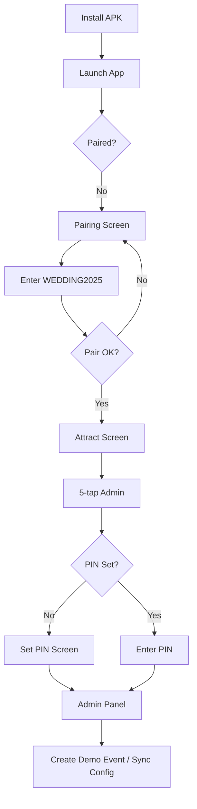
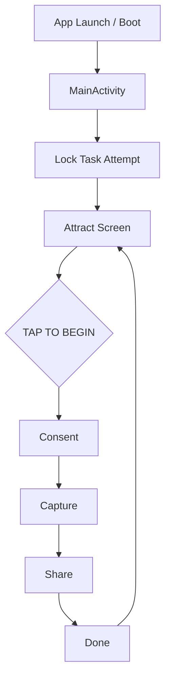
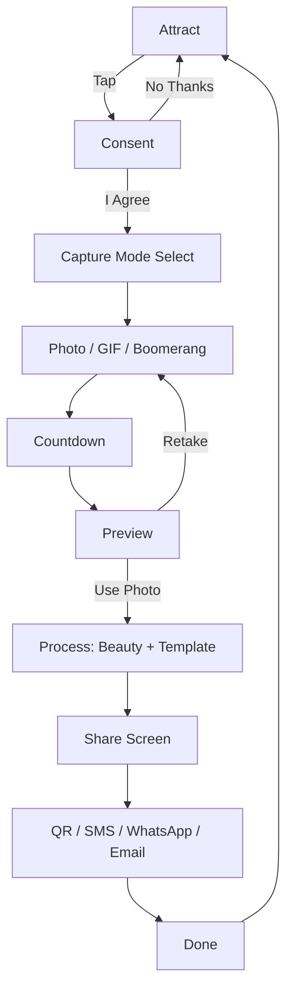
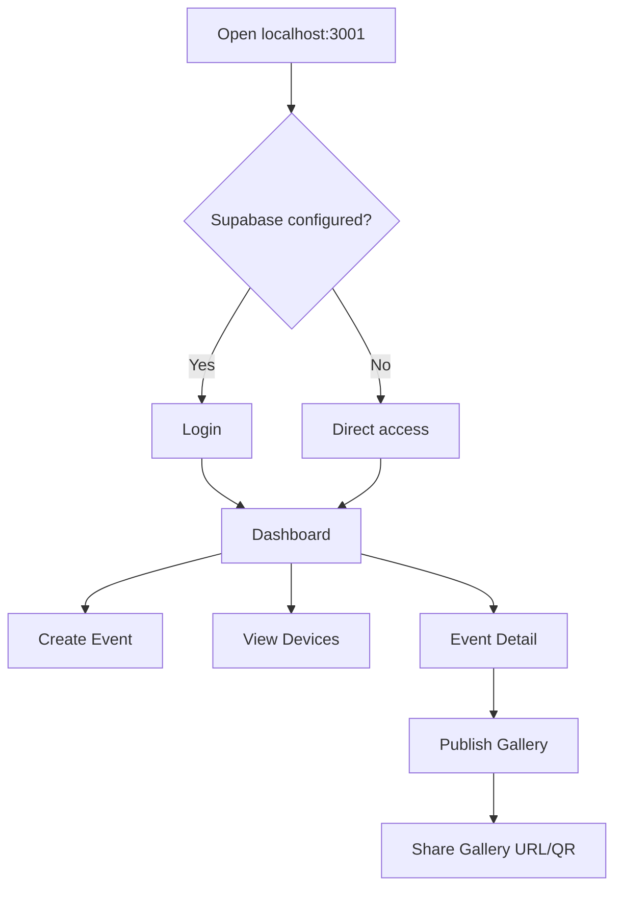
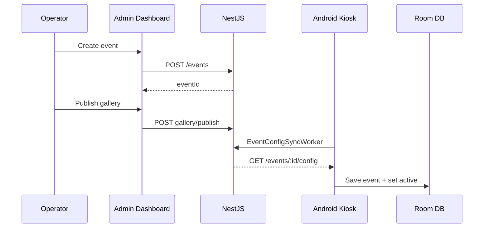
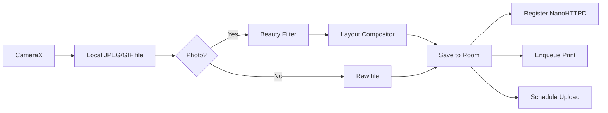
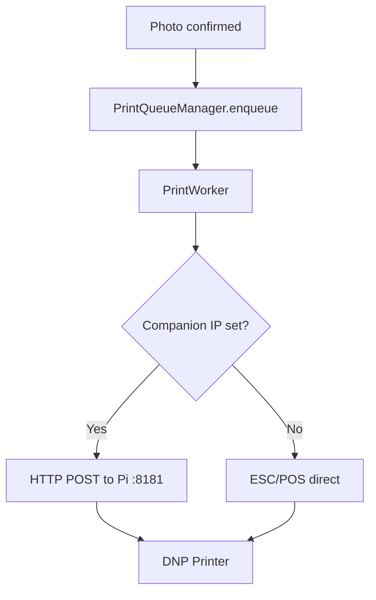

# User Flow Mapping

## Flow Legend

| Symbol | Meaning |
|--------|---------|
| ✅ | Working end-to-end |
| ⚠️ | Partial / caveats |
| ❌ | Not implemented |

---

## 1. First-Time User Flow (Kiosk Operator)

| Step | Action | Outcome | Failure Point |
|------|--------|---------|---------------|
| Install | Sideload devDebug APK | App on device | Wrong package name |
| Pair | Enter code | Token stored in DataStore | Firewall, wrong API URL |
| Set PIN | 4-8 digit PIN | BCrypt hash in EncryptedSharedPreferences | — |
| Bootstrap event | Auto or manual demo | Active event in Room | Was blocking consent (fixed) |

**Exit:** Ready for guest flow  
**Status:** ✅ Working (with demo bootstrap)

---

## 2. Returning User Flow (Paired Kiosk)

| Entry | BootReceiver or manual launch |
| Exit | Continuous loop at Attract |
| Failure | Battery optimization dialog every start |

**Status:** ✅ Working

---

## 3. Guest Flow (Primary Revenue Path)

| Step | User Action | System Response |
|------|-------------|-----------------|
| Consent | I Agree | Record consent; navigate |
| Capture | Select mode + Capture | CameraX capture |
| Preview | Use Photo | Filter + composite + save Room |
| Share | Scan QR | NanoHTTPD serves signed image |
| Done | Tap Done | Clear state; return attract |

**Failure Points:**
- No active event (mitigated by `ensureActiveEvent`)
- Camera permission denied (no graceful UI)
- SMS worker fails silently
- QR unreachable if wrong LAN IP

**Status:** ✅ Core path working

---

## 4. Authenticated User Flow (Admin Operator)

| Entry | Browser → admin dashboard |
| Auth | Supabase session OR dev bypass |
| Exit | Sign out → login |

**Failure Points:**
- `/api/*` routes skip middleware auth
- `ADMIN_API_KEY` mismatch → 401 on backend calls
- No RBAC — all operators have full access

**Status:** ⚠️ Partial

---

## 5. Admin Flow (On-Device Operator)

| Entry | 5-tap top-right on Attract |
| Steps | PIN → Unlock → Health panel |
| Actions | View queues, set Pi IP, create demo event, unpair |
| Exit | Exit Admin → Attract |
| Failure | Wrong PIN; no feedback on save failures |

**Status:** ✅ Working

---

## 6. Event Flow (Operator → Cloud → Kiosk)

**Failure:** Sync worker Hilt issue; demo bootstrap masks sync gaps  
**Status:** ⚠️ Partial

---

## 7. Capture Flow (Technical)

**Status:** ✅ Photo path; ⚠️ GIF/Boomerang encoder

---

## 8. Sharing Flow

### Online QR (LAN)
Guest scans QR → `http://{device-ip}:8080/media/{id}?token={hmac}` → NanoHTTPD validates → serves image

### Offline
Same — no cloud required. Token expires in 15 minutes.

### SMS
Kiosk → `POST /shares` → BullMQ → Twilio → guest phone

### WhatsApp / Email
Android system share intent with composite file

**Failure Points:**
- Emulator IP not reachable from physical phone
- Expired token → 401 (by design)
- Twilio not configured → queue fails

**Status:** ⚠️ QR ✅; SMS ⚠️; intents ✅

---

## 9. Print Flow

**Status:** ⚠️ Needs hardware validation

---

## 10. AI Generation Flow

**Scope:** Admin only (not guest-facing)

| Entry | Create Event form |
| Action | Click AI generate on consent/hashtag |
| API | `POST /api/ai/generate` → GPT-4o-mini |
| Auth | Supabase session required |
| Outcome | Text populated in form field |

**Guest AI (beauty):** Applied automatically on photo confirm — not user-selectable.

**Status:** Admin ✅; Guest filter ⚠️ stub

---

## 11. Purchase / Payment Flow

**Status:** ❌ **Does not exist**

No checkout, subscription, in-app purchase, or Stripe integration anywhere in codebase. Listed only as future item in `PLATFORM_MIGRATION.md`.

---

## 12. Settings Flow

### Admin Settings (`/settings`)
Read-only display of API URL and Supabase status. No editable configuration.

### Kiosk Settings (Admin panel)
Companion Host IP, PIN management (set once), unpair.

**Status:** ⚠️ Minimal

---

## Journey Scores (1–10)

| Journey | Usability | Simplicity | Accessibility | Delight | Conversion |
|---------|-----------|------------|---------------|---------|------------|
| Guest capture | 7 | 8 | 5 | 6 | 7 |
| Guest share (QR) | 6 | 7 | 4 | 5 | 6 |
| Operator pairing | 5 | 6 | 5 | 4 | N/A |
| Admin event create | 7 | 6 | 6 | 7 | N/A |
| Admin monitoring | 6 | 5 | 5 | 5 | N/A |
| On-device admin | 5 | 5 | 4 | 3 | N/A |
| Public gallery | 7 | 8 | 6 | 7 | 6 |
| Payment | — | — | — | — | 0 |

**Lowest scores:** Accessibility (no TalkBack testing), on-device admin delight, payment (nonexistent).
