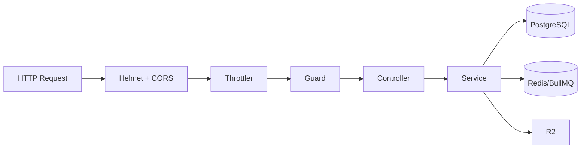
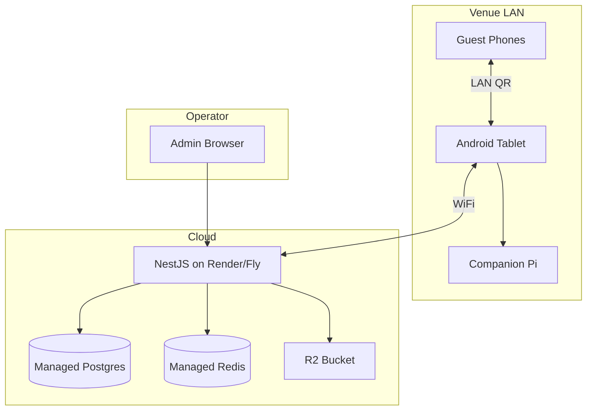

# Technical Architecture

## System Overview

Wedding Photobooth is a **three-tier offline-first system**:

1. **Android Kiosk** — capture, local share, print queue, background sync
2. **NestJS Backend** — auth, media pipeline, gallery, SMS, retention
3. **Next.js Admin** — operator UI, gallery publish, fleet visibility

Optional fourth tier: **Companion Print Host** (Raspberry Pi) for DNP printers.

---

## Android Architecture

### Module Graph

```
app
├── core:domain      # Models, repository interfaces, use cases
├── core:data        # Repository impls, DataStore, PinManager
├── core:database    # Room entities, DAOs, SQLCipher
├── core:network     # Retrofit API, DTOs
├── core:designsystem# BigButton, CountdownOverlay, theme
├── feature:attract
├── feature:consent
├── feature:capture
├── feature:overlay
├── feature:ai
├── feature:printing
├── feature:sharing
├── feature:sync
├── feature:admin
├── hardware:camera
├── hardware:printer
└── kiosk
```

### Patterns

| Pattern | Usage |
|---------|-------|
| MVVM | ViewModels per feature + Hilt injection |
| Repository | Domain interfaces → data implementations |
| Offline-first | Room as source of truth; WorkManager sync |
| Navigation | Single `NavHost`, 6 routes |
| DI | Hilt modules in `app/di/` |

### Key Services

| Service | Port/Location | Role |
|---------|---------------|------|
| `LocalMediaServer` | :8080 | NanoHTTPD signed media |
| `SyncScheduler` | WorkManager | Upload, share, config, token refresh |
| `PrintQueueManager` | Room queue | Print job orchestration |
| `KioskModeManager` | — | Lock Task / immersive fallback |

### Data Persistence

| Store | Contents | Encryption |
|-------|----------|------------|
| Room (SQLCipher) | Events, captures, shares, consent, print jobs | SQLCipher passphrase |
| DataStore | Device token, pairing state, companion IP | Plaintext (debt) |
| EncryptedSharedPreferences | PIN hash, QR signing key | AES-256-GCM |

---

## Backend Architecture

### Module Structure

```
backend/src/
├── app.module.ts
├── devices/       # Pairing, token refresh, fleet
├── events/        # CRUD, gallery publish, config
├── captures/      # Presign upload, complete, processing trigger
├── gallery/       # Public token-gated gallery
├── sharing/       # Share queue + Twilio webhook
├── sms/           # Twilio client
├── media/         # sharp variant processing
├── storage/       # R2 S3 client
├── retention/     # Cron sweep + manual trigger
├── analytics/     # Batch ingest + PostHog
├── workers/       # BullMQ SMS processor
└── auth/guards/   # DeviceToken, TwilioSignature
```

### Request Pipeline



### Async Processing

| Job | Mechanism | Status |
|-----|-----------|--------|
| SMS send | BullMQ `sms` queue, concurrency 3 | ✅ |
| Media variants | `setImmediate` in-process sharp | ⚠️ Not queued |
| Email | BullMQ queue registered | ❌ No worker |
| WhatsApp | BullMQ queue registered | ❌ No worker |
| Retention | Cron `@Cron('0 2 * * *')` | ✅ |

---

## Admin Dashboard Architecture

### Stack

- **Next.js 14** App Router (mixed Server + Client Components)
- **Tailwind CSS** custom design tokens
- **Supabase** optional auth + realtime
- **API proxy routes** for backend calls (hide admin key server-side)

### Rendering Strategy

| Page | Strategy |
|------|----------|
| `/events`, `/devices` | Server Component — fetch on render |
| `/events/[id]` | Client — `useEffect` fetch |
| `/gallery/[eventId]` | Server + ISR `revalidate: 30` |
| `/` dashboard | Client — GSAP animations |

### Auth Layers

1. Edge middleware — Supabase session check
2. Backend — `X-Admin-Api-Key` header on proxied calls
3. Gallery — query token (no session)
4. AI route — inline Supabase session check

---

## Companion Host Architecture

**Path:** `companion-host/`

- Python `ThreadingHTTPServer` on port 8181
- `X-Print-Token` authentication
- Receives print jobs from Android `PrintWorker`
- systemd service via `setup.sh`

**Status:** Implemented; production-tested status unknown.

---

## Third-Party Integrations

| Service | SDK/Package | Used By | Config |
|---------|-------------|---------|--------|
| Cloudflare R2 | `@aws-sdk/client-s3` | Backend | `R2_*` env vars |
| Twilio | `twilio` | Backend SMS worker | `TWILIO_*` |
| PostHog | `posthog-node`, `posthog-js` | Backend, Admin | API key |
| Sentry | `@sentry/node` | Backend | DSN (5xx only) |
| OpenAI | `openai` | Admin `/api/ai/generate` | `OPENAI_API_KEY` |
| Supabase | `@supabase/ssr` | Admin auth/realtime | URL + anon key |
| CameraX | AndroidX | Kiosk camera | — |
| NanoHTTPD | `fi.iki.elonen` | Local QR server | — |
| ZXing | QR generation | Share + admin | — |
| sharp | Image processing | Backend media | — |
| BullMQ | Job queue | SMS | Redis URL |

### Not Integrated

- Stripe / payments
- FCM push notifications
- SendGrid / email provider
- WhatsApp Business API
- Firebase Crashlytics (local crash files only)

---

## Deployment Topology



### Build Flavors (Android)

| Flavor | API Base URL |
|--------|--------------|
| dev | `http://10.0.2.2:3000/api/v1/` |
| staging | Configurable |
| prod | Production URL |

---

## Architecture Strengths

1. Clean module boundaries (19 Android modules)
2. Offline-first with idempotency keys
3. Signed local QR URLs (security-conscious)
4. Cursor-based gallery pagination
5. Retention sweep with PII scrubbing
6. Separation of guest (device token) vs operator (admin key) auth

## Architecture Weaknesses

1. No foreign keys in database — referential integrity not enforced
2. Media processing in-process (not workerized)
3. Tenant hardcoded `"default"` — no multi-tenancy
4. Duplicate `DeviceCredentialsStore` in sync module
5. No API gateway / WAF layer documented
6. Admin and Android design systems completely separate

---

## Scalability Assessment

| Concern | Current Limit | Bottleneck |
|---------|---------------|------------|
| Concurrent uploads | Single Node process | In-process sharp |
| SMS throughput | 3/sec rate limit | Twilio account |
| Gallery reads | 60 req/min/IP throttle | Single Nest instance |
| Devices per event | Untested | No load tests |
| Storage | R2 per-event prefix | No lifecycle policies beyond retention |

**Score:** 55/100 — adequate for single-event beta; not multi-tenant scale.
