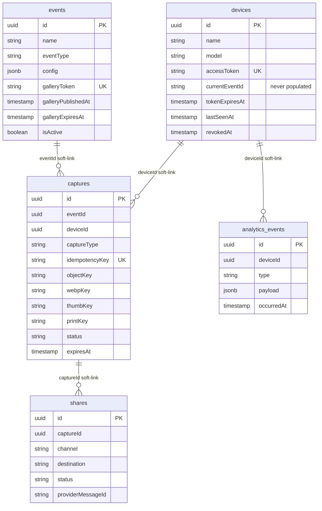
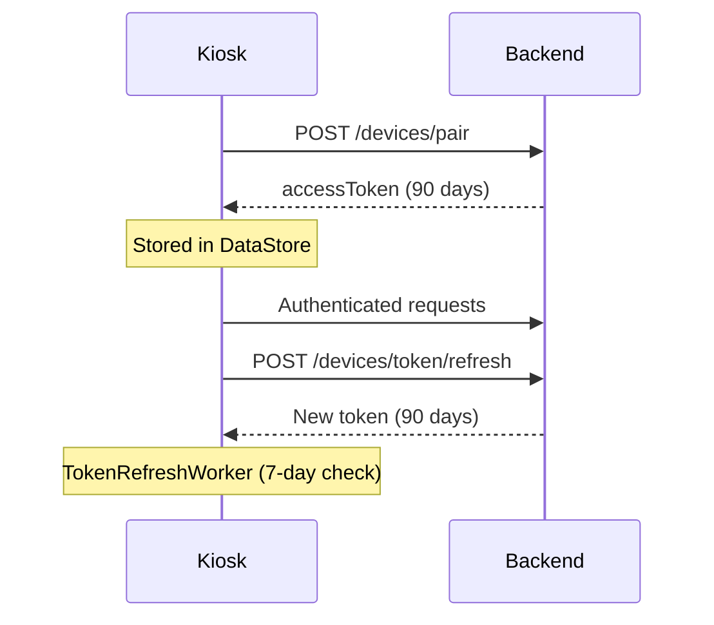
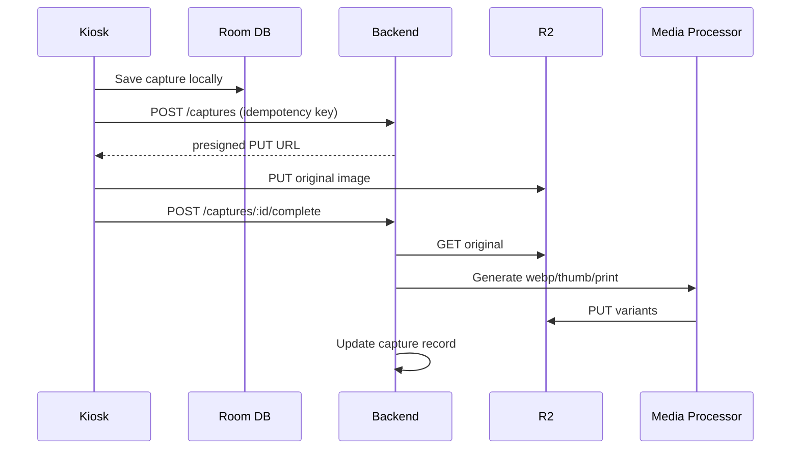
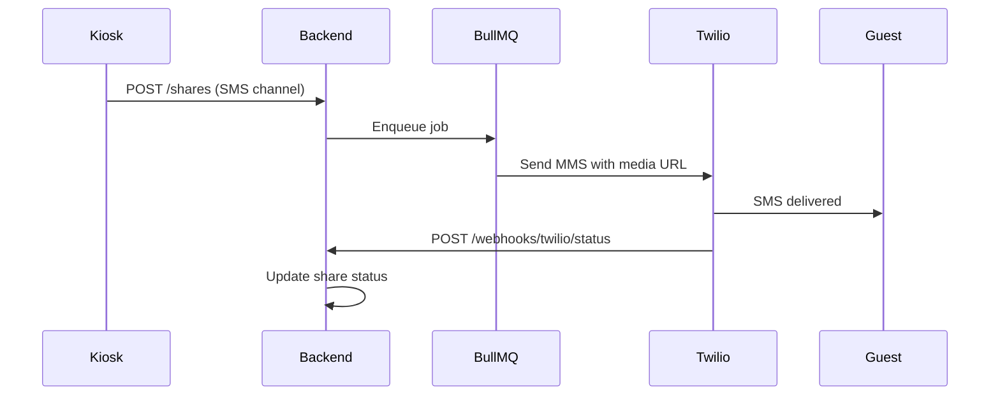
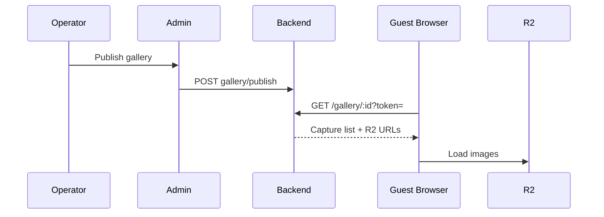

# Database & API Audit

## Database Structure

### PostgreSQL Tables (5)

**Note:** No `@ManyToOne` / FK constraints — soft-linked by UUID columns only.

### Indexes (Migration 5)

| Index | Table | Columns | Purpose |
|-------|-------|---------|---------|
| Composite | captures | `(eventId, createdAt DESC)` | Gallery pagination |
| Partial | captures | `expiresAt WHERE status != 'deleted'` | Retention sweep |
| Partial | shares | `providerMessageId WHERE NOT NULL` | Twilio webhook lookup |
| Standard | devices | `lastSeenAt` | Fleet health |

### Missing Indexes

- `captures.status`
- `shares.captureId`
- `captures.deviceId`
- `analytics_events.(deviceId, occurredAt)`

---

## Android Room Database (7 tables)

| Table | Purpose |
|-------|---------|
| `events` | Local event config |
| `captures` | Capture records + paths |
| `shares` | Outbound share queue |
| `consent_records` | GDPR consent log |
| `print_jobs` | Print queue |
| `sync_state` | Last sync timestamps |
| `active_event` | Singleton active event pointer |

**Encryption:** SQLCipher via Room

---

## API Catalog

Base URL: `/api/v1`

### Devices

| Method | Endpoint | Auth | Purpose |
|--------|----------|------|---------|
| POST | `/devices/pair` | None (rate 3/min) | Register device, return 90-day token |
| POST | `/devices/token/refresh` | Device token | Rotate access token |
| GET | `/devices` | Admin API key | List all devices |

### Events

| Method | Endpoint | Auth | Purpose |
|--------|----------|------|---------|
| POST | `/events` | Admin key | Create event |
| GET | `/events` | Admin key | List events |
| GET | `/events/:id/config` | Device token | Config for kiosk |
| GET | `/events/:id/stats` | Admin key | Capture/share counts |
| GET | `/events/:id/detail` | Admin key | Rich detail view |
| POST | `/events/:id/gallery/publish` | Admin key | Publish gallery |
| DELETE | `/events/:id/gallery/publish` | Admin key | Unpublish + rotate token |

### Captures

| Method | Endpoint | Auth | Purpose |
|--------|----------|------|---------|
| POST | `/captures` | Device token | Create + presigned PUT URL (15min) |
| POST | `/captures/:id/complete` | Device token | Confirm upload, trigger processing |

### Gallery (Public)

| Method | Endpoint | Auth | Purpose |
|--------|----------|------|---------|
| GET | `/gallery/:eventId` | Query token | Paginated gallery (cursor, max 100) |

### Shares

| Method | Endpoint | Auth | Purpose |
|--------|----------|------|---------|
| POST | `/shares` | Device token (rate 10/min) | Queue share (SMS etc.) |

### Webhooks

| Method | Endpoint | Auth | Purpose |
|--------|----------|------|---------|
| POST | `/webhooks/twilio/status` | Twilio signature (prod) | Delivery status |

### Analytics

| Method | Endpoint | Auth | Purpose |
|--------|----------|------|---------|
| POST | `/analytics/batch` | Manual token check | Batch event ingest |

### Admin

| Method | Endpoint | Auth | Purpose |
|--------|----------|------|---------|
| POST | `/admin/retention/sweep` | Admin key | Manual retention run |

### Health

| Method | Endpoint | Auth | Purpose |
|--------|----------|------|---------|
| GET | `/health` | None | DB, Redis, queue depths, version |

### Admin Dashboard Internal APIs

| Method | Route | Purpose |
|--------|-------|---------|
| GET | `/api/dashboard/stats` | Aggregate stats |
| POST | `/api/events` | Proxy create event |
| GET | `/api/events/[id]/detail` | Proxy event detail |
| POST/DELETE | `/api/events/[id]/gallery/publish` | Gallery toggle |
| GET | `/api/gallery/download` | Image download proxy |
| POST | `/api/ai/generate` | GPT-4o-mini content |

### On-Device API (NanoHTTPD)

| Method | Path | Auth | Purpose |
|--------|------|------|---------|
| GET | `/media/:captureId?token=` | HMAC token (15min) | Serve local image |

---

## Authentication

### Methods

| Actor | Method | Header/Param |
|-------|--------|--------------|
| Kiosk device | Bearer token (64-char hex) | `Authorization: Bearer {token}` |
| Admin operator | API key | `X-Admin-Api-Key: {key}` |
| Admin user | Supabase session | Cookie (dashboard only) |
| Gallery guest | Gallery token | `?token={12-char hex}` |
| Local QR guest | HMAC signed token | `?token={captureId:expires:sig}` |
| Twilio webhook | Request signature | `X-Twilio-Signature` |

### Roles & Permissions

| Role | Capabilities | Gap |
|------|--------------|-----|
| Anonymous | Health, pair (with code), gallery (with token) | — |
| Device | Captures, shares, config, token refresh | No per-event scope |
| Admin | All management endpoints | No RBAC; key is all-or-nothing |
| Supabase user | Dashboard access only | Not linked to backend roles |

### Token Lifecycle

---

## Data Flow

### Capture Upload Flow

### Share SMS Flow

### Gallery View Flow

---

## Data Validation

| Layer | Validation |
|-------|------------|
| Backend DTOs | class-validator decorators |
| Create event | retentionDays 1–365, consent min 20 chars |
| SMS phone | E.164 regex in SmsService |
| Capture complete | Magic byte check (JPEG/PNG/WebP) |
| Gallery token | 12-char hex regex |
| Android SMS input | E.164 regex in ShareScreen |

### Validation Gaps

- `CompleteCaptureDto.objectKey` not validated against stored key
- `contentType` on capture create is free-form string
- Share destination not validated at API layer for SMS/email
- No file size limits on upload
