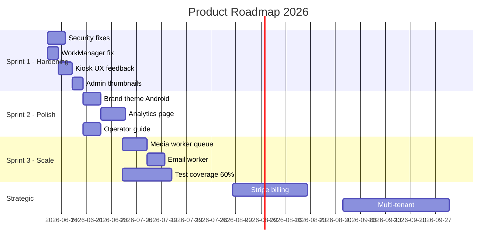

# Optimization Roadmap & Technical Debt

Scoring: **Impact** (1–10), **Effort** (1–10), **Priority** = Impact ÷ Effort × 10

---

## Quick Wins (< 1 Day)

| # | Task | Impact | Effort | Priority | Outcome |
|---|------|--------|--------|----------|---------|
| QW-01 | Fail-closed AdminApiKeyGuard | 9 | 1 | 90 | Close critical auth bypass |
| QW-02 | Fix WorkManager Hilt manifest init | 9 | 2 | 45 | Background sync works |
| QW-03 | Skip battery optimization on dev builds | 6 | 1 | 60 | Better dev/emulator UX |
| QW-04 | Dark splash theme (Android) | 5 | 2 | 25 | Eliminate white flash |
| QW-05 | SMS/upload toast feedback on share screen | 7 | 2 | 35 | Guest knows share status |
| QW-06 | QR URL text + copy on share screen | 6 | 2 | 30 | Emulator + debugging |
| QW-07 | Validate objectKey on capture complete | 8 | 1 | 80 | Close hijack vector |
| QW-08 | Delete duplicate DeviceCredentialsStore in sync | 6 | 1 | 60 | Reduce confusion/bugs |
| QW-09 | Offline banner on kiosk | 7 | 2 | 35 | Operator visibility |
| QW-10 | Remove `/analytics` placeholder or add redirect | 3 | 1 | 30 | Reduce confusion |

---

## Medium Improvements (< 1 Week)

| # | Task | Impact | Effort | Priority | Outcome |
|---|------|--------|--------|----------|---------|
| MI-01 | Capture thumbnails in event detail (thumbKey) | 8 | 3 | 27 | Admin visual confirmation |
| MI-02 | Move media processing to BullMQ worker | 8 | 5 | 16 | Backend scales under load |
| MI-03 | Migrate device token to EncryptedSharedPreferences | 7 | 3 | 23 | Android security hardening |
| MI-04 | Hash device tokens in backend DB | 7 | 4 | 18 | DB breach mitigation |
| MI-05 | Mobile-responsive admin sidebar | 7 | 4 | 18 | Operator mobile access |
| MI-06 | Fix GIF encoder extension block swap | 6 | 3 | 20 | GIF works on strict parsers |
| MI-07 | Add 4 missing database indexes | 6 | 2 | 30 | Query performance |
| MI-08 | QR scanner on pairing screen | 7 | 5 | 14 | Faster device provisioning |
| MI-09 | Increase gallery token entropy (32 bytes) | 7 | 3 | 23 | Gallery security |
| MI-10 | Operator setup guide (non-developer) | 8 | 5 | 16 | Field deployment without engineer |
| MI-11 | Playwright E2E expansion (capture flow) | 7 | 5 | 14 | Regression safety |
| MI-12 | Backend integration tests for auth guards | 8 | 4 | 20 | Security regression tests |
| MI-13 | Apply luxury gold theme to Android Material3 | 6 | 4 | 15 | Brand consistency |
| MI-14 | Aggregate dashboard stats endpoint | 5 | 3 | 17 | Faster admin load |
| MI-15 | Camera permission rationale + recovery UI | 6 | 3 | 20 | Kiosk reliability |

---

## Major Improvements (< 1 Month)

| # | Task | Impact | Effort | Priority | Outcome |
|---|------|--------|--------|----------|---------|
| MAJ-01 | Email share worker (SendGrid/SES) | 7 | 6 | 12 | Complete share channel matrix |
| MAJ-02 | WhatsApp Business API worker | 6 | 7 | 9 | Automated WA sharing |
| MAJ-03 | Real analytics page (charts, time series) | 7 | 7 | 10 | Operator insights |
| MAJ-04 | Event edit/delete in admin | 6 | 5 | 12 | Full event lifecycle |
| MAJ-05 | Device revocation + fleet management | 7 | 6 | 12 | Security + ops |
| MAJ-06 | End-event flow (kiosk shows inactive) | 6 | 5 | 12 | Post-event correctness |
| MAJ-07 | Shared cross-platform design tokens | 6 | 6 | 10 | Brand unity |
| MAJ-08 | TFLite beauty filter (GPU) | 5 | 8 | 6 | Premium photo quality |
| MAJ-09 | Template library (5+ overlays) | 7 | 7 | 10 | Competitive parity |
| MAJ-10 | Privacy policy + cookie consent | 7 | 4 | 18 | GDPR compliance |
| MAJ-11 | Test coverage to 60% (backend + E2E) | 8 | 8 | 10 | Launch gate |
| MAJ-12 | Multi-event switcher per device | 6 | 7 | 9 | Agency use case |
| MAJ-13 | Remote crash reporting pipeline | 7 | 6 | 12 | Ops visibility |
| MAJ-14 | Instagram/Facebook direct share | 6 | 7 | 9 | Social viral loop |

---

## Strategic Improvements (Long-Term)

| # | Task | Impact | Effort | Priority | Outcome |
|---|------|--------|--------|----------|---------|
| STR-01 | Stripe subscription billing | 9 | 9 | 10 | Revenue engine |
| STR-02 | Multi-tenant SaaS (tenant_id) | 9 | 10 | 9 | Platform scale |
| STR-03 | Self-serve operator onboarding | 8 | 9 | 9 | Reduce CAC |
| STR-04 | MDM auto-provisioning script | 7 | 8 | 9 | Eliminate manual Device Owner |
| STR-05 | AI background segmentation (TFLite) | 7 | 9 | 8 | Premium differentiation |
| STR-06 | Social wall / live display mode | 6 | 8 | 8 | Venue upsell |
| STR-07 | Multi-booth fleet dashboard | 7 | 9 | 8 | Exhibition market |
| STR-08 | DSLR tether module | 5 | 10 | 5 | Pro photographer market |
| STR-09 | White-label platform for venues | 8 | 10 | 8 | Enterprise revenue |
| STR-10 | Guest web capture (no kiosk) | 5 | 9 | 6 | New use case |

---

## Technical Debt List

### Critical (Block Launch)

| ID | Debt | Location | Status |
|----|------|----------|--------|
| TD-01 | AdminApiKeyGuard fail-open | `admin-api-key.guard.ts` | Open |
| TD-02 | WorkManager Hilt worker init | Android manifest | Open |
| TD-03 | Device token plaintext (DB + DataStore) | Backend + Android | Open |
| TD-04 | SQLCipher passphrase in source | `core/database` | Open |
| TD-05 | Media processing in-process | `media-processor.service.ts` | Open |
| TD-06 | Zero comprehensive test coverage | All stacks | Improved (~28 backend) |

### High

| ID | Debt | Status |
|----|------|--------|
| TD-07 | Duplicate DeviceCredentialsStore | Open |
| TD-08 | GIF encoder extension block bug | Open |
| TD-09 | No FK constraints in database | Open |
| TD-10 | `currentEventId` never populated | Open |
| TD-11 | Email/WhatsApp queues without workers | Open |
| TD-12 | Admin `/api/*` skips auth middleware | Open |
| TD-13 | Gallery token low entropy | Open |

### Medium

| ID | Debt | Status |
|----|------|--------|
| TD-14 | No shared design system cross-platform | Open |
| TD-15 | Analytics page placeholder | Open |
| TD-16 | Capture thumbnails not rendered in admin | Open |
| TD-17 | Tenant hardcoded `"default"` | Open |
| TD-18 | SMS message body hardcoded | Open |
| TD-19 | No operator onboarding docs | Open |
| TD-20 | `.next/` build artifact in repo | Open |

### Low

| ID | Debt | Status |
|----|------|--------|
| TD-21 | No bundle analyzer configured | Open |
| TD-22 | `sessions: 0, leads: 0` hardcoded in stats | Open |
| TD-23 | No API versioning beyond `/v1` prefix | Open |
| TD-24 | Accidental git files (Untitled, local.properties) | Open |

---

## Suggested Next Sprint (2 Weeks)

**Theme:** *"Beta Hardening — Make It Trustworthy"*

### Sprint Goals
1. Close all critical security gaps
2. Fix background sync reliability
3. Add operator-visible feedback on kiosk
4. Expand test coverage for auth + guest flow

### Sprint Backlog (Ordered)

| Day | Task | Owner |
|-----|------|-------|
| 1 | QW-01: Fail-closed AdminApiKeyGuard | Backend |
| 1 | QW-07: Validate objectKey on complete | Backend |
| 2 | QW-02: Fix WorkManager Hilt init | Android |
| 2 | QW-08: Remove duplicate credentials store | Android |
| 3 | QW-05: Share screen toasts | Android |
| 3 | QW-06: QR URL copy fallback | Android |
| 4 | QW-04: Dark splash theme | Android |
| 4 | QW-09: Offline banner | Android |
| 5 | MI-07: Add missing DB indexes | Backend |
| 5 | MI-12: Auth guard integration tests | Backend |
| 6–7 | MI-01: Capture thumbnails in admin | Admin |
| 8–9 | MI-10: Operator setup guide | Docs |
| 10 | MI-06: Fix GIF encoder | Android |

### Sprint Exit Criteria

- [ ] Field test checklist passes Phases 1–4 without silent failures
- [ ] Upload appears in admin within 60s of capture (WiFi on)
- [ ] Security curl tests全部 return expected status codes
- [ ] No critical security items remain open
- [ ] At least 40 backend tests passing

### Sprint Non-Goals (Defer)

- Stripe / payments
- Analytics charts
- AI background segmentation
- Multi-tenant

---

## Prioritized Roadmap (Visual)

---

## Missing Features (Complete List)

| Feature | Priority | Sprint |
|---------|----------|--------|
| Payment / Stripe | Strategic | Q3 2026 |
| Email share worker | Major | Sprint 3 |
| WhatsApp API worker | Major | Sprint 3 |
| Analytics charts | Major | Sprint 2 |
| Event edit/delete | Major | Sprint 3 |
| Device revocation UI | Major | Sprint 3 |
| End-event kiosk flow | Major | Sprint 3 |
| QR scanner (pairing) | Medium | Sprint 2 |
| Push notifications | Strategic | Q4 2026 |
| Multi-tenant | Strategic | Q3 2026 |
| Green screen / AI BG | Strategic | Q4 2026 |
| Social wall display | Strategic | Q4 2026 |
| Guest web capture | Strategic | Q4 2026 |
| DSLR tether | Strategic | Deferred |
| Role-based admin | Major | Sprint 3 |
| Privacy policy page | Major | Sprint 2 |
| Operator onboarding app | Strategic | Q3 2026 |
