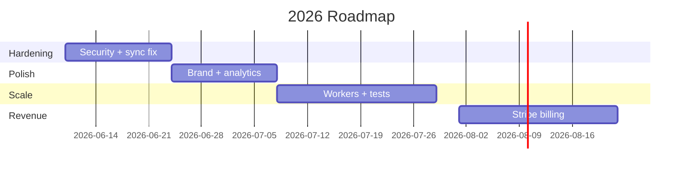

# Wedding Photobooth — Comprehensive Product Audit

**Date:** June 10, 2026  
**Type:** Read-only discovery audit (no code changes)  
**Scope:** Android kiosk, NestJS backend, Next.js admin, companion print host

---

## Table of Contents

1. [Executive Summary](#1-executive-summary)
2. [Product Overview](#2-product-overview)
3. [Complete Feature Inventory](#3-complete-feature-inventory)
4. [Complete Screen Inventory](#4-complete-screen-inventory)
5. [User Flow Diagrams](#5-user-flow-diagrams)
6. [Technical Architecture](#6-technical-architecture)
7. [Database Architecture](#7-database-architecture)
8. [API Documentation](#8-api-documentation)
9. [UX Audit](#9-ux-audit)
10. [UI Audit](#10-ui-audit)
11. [Performance Audit](#11-performance-audit)
12. [Security Audit](#12-security-audit)
13. [Business Analysis](#13-business-analysis)
14. [Missing Features](#14-missing-features)
15. [Optimization Opportunities](#15-optimization-opportunities)
16. [Prioritized Roadmap](#16-prioritized-roadmap)
17. [Technical Debt List](#17-technical-debt-list)
18. [Suggested Next Sprint](#18-suggested-next-sprint)

**Detailed reports:** [00_INDEX.md](./00_INDEX.md)

---

## 1. Executive Summary

Wedding Photobooth is an **offline-first Android wedding kiosk** with NestJS cloud sync, Next.js operator admin, and Cloudflare R2 storage. The core guest loop works: pair → attract → consent → capture → share.

| Dimension | Score | Verdict |
|-----------|-------|---------|
| Architecture | 72/100 | Solid modular design |
| Feature completeness | 58/100 | Core works; many partial |
| UX | 58/100 | Guest OK; admin thin |
| Security | 48/100 | Critical gaps |
| Business readiness | 35/100 | No monetization |
| **Overall** | **54/100** | **Private beta only** |

**Recommendation:** Deploy at 1–3 weddings with on-site engineer. Block commercial self-serve launch until security hardening, background sync fix, and test coverage improve.

**Key strengths:** Offline QR sharing, modular architecture, idempotent uploads, signed local URLs, retention sweep.

**Key risks:** Admin API key bypass, WorkManager Hilt failures, no payments, no operator onboarding, plaintext device tokens.

---

## 2. Product Overview

**Problem:** Guests want instant branded photos at weddings; operators need reliable kiosk + cloud gallery.

**Audience:** Luxury wedding operators (primary); Kerala traditional weddings (strong fit).

**Stack:** Kotlin/Compose Android · NestJS/PostgreSQL/Redis · Next.js admin · R2 · Twilio · PostHog

**Value prop:** *"Branded, offline-resilient wedding photobooth with instant QR sharing and operator dashboard."*

See [01_EXECUTIVE_SUMMARY.md](./01_EXECUTIVE_SUMMARY.md) for component discovery matrix.

---

## 3. Complete Feature Inventory

| Category | Complete | Partial | Missing |
|----------|----------|---------|---------|
| Core guest loop | 8 | 3 | 1 |
| AI | 2 | 2 | 2 |
| Sharing | 5 | 2 | 1 |
| Admin | 8 | 3 | 4 |
| Printing | 3 | 3 | 0 |
| Payment | 0 | 0 | 1 |

**Notable:** Payment/Stripe does not exist. Email/WhatsApp backend workers registered but not implemented. Beauty filter is CPU blur stub.

Full inventory: [02_FEATURES.md](./02_FEATURES.md)

---

## 4. Complete Screen Inventory

| Platform | Screens | Working | Partial | Placeholder |
|----------|---------|---------|---------|-------------|
| Android kiosk | 7 | 6 | 1 | 0 |
| Admin dashboard | 10 | 7 | 1 | 2 |

**Placeholder screens:** `/analytics` (duplicates dashboard), `/settings` (read-only).

Full inventory with components and data sources: [03_SCREENS.md](./03_SCREENS.md)

---

## 5. User Flow Diagrams

### Guest Flow (Primary)
```
Attract → Consent → Capture (Photo/GIF/Boomerang) → Process → Share → Done → Attract
```
**Status:** ✅ Working (consent fix + demo event bootstrap applied)

### Operator Flow
```
Admin login → Dashboard → Create Event → Publish Gallery → Monitor devices
```
**Status:** ⚠️ Partial (no edit/delete, thin analytics)

### Payment Flow
**Status:** ❌ Does not exist

All flows with mermaid diagrams: [04_USER_FLOWS.md](./04_USER_FLOWS.md)

---

## 6. Technical Architecture

Three-tier offline-first system with optional companion print host (Raspberry Pi).

```
Android (19 modules) ↔ NestJS API ↔ PostgreSQL + Redis + R2
Next.js Admin ↔ NestJS API
Guest Phone ↔ NanoHTTPD :8080 (LAN QR)
```

**Strengths:** Clean boundaries, offline-first, signed QR URLs.  
**Weaknesses:** No FK constraints, in-process media processing, hardcoded tenant, duplicate credentials store.

Full architecture: [05_ARCHITECTURE.md](./05_ARCHITECTURE.md)

---

## 7. Database Architecture

**PostgreSQL:** 5 tables (devices, events, captures, shares, analytics_events) — soft-linked UUIDs, no FK constraints, 5 migrations, 4 index gaps.

**Android Room:** 7 tables (SQLCipher encrypted) — events, captures, shares, consent, print_jobs, sync_state, active_event.

ER diagram and relationships: [06_DATABASE_API.md](./06_DATABASE_API.md)

---

## 8. API Documentation

**14 backend endpoints** at `/api/v1` plus 6 admin internal proxy routes and 1 on-device NanoHTTPD endpoint.

| Auth type | Used by |
|-----------|---------|
| Device Bearer token | Captures, shares, config |
| Admin API key | Event/device management |
| Gallery query token | Public gallery |
| HMAC signed token | Local QR media |

Full catalog with methods and guards: [06_DATABASE_API.md](./06_DATABASE_API.md)

---

## 9. UX Audit

**Average usability:** 6.2/10  
**Average accessibility:** 5.0/10 (critical gap)

**Top friction:** Battery optimization dialog every launch; no SMS feedback; no QR scanner for pairing; admin not mobile-responsive.

**Journey scores:** Guest capture 7/10 usability; on-device admin 3/10 delight.

Full UX audit: [07_UX_AUDIT.md](./07_UX_AUDIT.md)

---

## 10. UI Audit

**Admin + gallery:** Polished dark luxury (gold accent, Cormorant Garamond) — 8/10.  
**Android kiosk:** Generic Material3 light theme — 5/10. Brand disconnect between platforms.

**Critical inconsistency:** Light Android vs dark admin. No mobile admin sidebar.

Full UI audit: [08_UI_AUDIT.md](./08_UI_AUDIT.md)

---

## 11. Performance Audit

| Layer | Score | Top issue |
|-------|-------|-----------|
| Admin frontend | 6/10 | Bundle weight (html2canvas + gsap) |
| Backend | 6.5/10 | In-process sharp media processing |
| Android | 5.5/10 | 6s cold start, WorkManager failures |

No load benchmarks run yet. Recommended: Macrobenchmark cold start, k6 concurrent uploads.

Full performance audit: [09_PERFORMANCE.md](./09_PERFORMANCE.md)

---

## 12. Security Audit

**Score: 48/100**

| Severity | Count | Top item |
|----------|-------|----------|
| Critical | 4 | AdminApiKeyGuard fail-open |
| Medium | 6 | Gallery token entropy, webhook bypass |
| Low | 5 | No device revocation endpoint |

Full security audit: [10_SECURITY.md](./10_SECURITY.md)

---

## 13. Business Analysis

**Problem solved:** Instant branded wedding photos with offline reliability.  
**Revenue today:** $0 — no Stripe, no billing, no pricing.  
**First monetization:** Per-event operator license ($200–500/event).  
**Competitive advantage:** Offline-first, open architecture, kiosk lockdown.  
**Competitive gap:** Polish, template library, self-serve onboarding vs Snappic/LumaBooth.

Full business + competitive analysis: [11_BUSINESS.md](./11_BUSINESS.md)

---

## 14. Missing Features

| Feature | Priority |
|---------|----------|
| Payment / Stripe | Strategic |
| Email/WhatsApp workers | Major |
| Analytics charts | Major |
| Event edit/delete | Major |
| Device revocation | Major |
| End-event kiosk flow | Major |
| QR scanner pairing | Medium |
| Push notifications | Strategic |
| Multi-tenant SaaS | Strategic |
| AI background removal | Strategic |
| Privacy policy | Major |
| Operator onboarding (non-dev) | Major |

---

## 15. Optimization Opportunities

### Quick Wins (< 1 day)
- Fail-closed admin guard
- WorkManager Hilt fix
- Share screen toasts
- Dark splash theme
- objectKey validation

### Medium (< 1 week)
- Capture thumbnails in admin
- Media processing → BullMQ
- Mobile admin sidebar
- Operator setup guide
- Gallery token entropy increase

### Major (< 1 month)
- Email worker, analytics charts, event lifecycle, test coverage 60%

### Strategic (long-term)
- Stripe billing, multi-tenant, self-serve onboarding, AI backgrounds

Impact/effort scoring: [12_ROADMAP.md](./12_ROADMAP.md)

---

## 16. Prioritized Roadmap



Full roadmap: [12_ROADMAP.md](./12_ROADMAP.md)

---

## 17. Technical Debt List

**Critical (6):** AdminApiKeyGuard, WorkManager Hilt, plaintext tokens, SQLCipher passphrase in source, in-process media, test coverage.

**High (7):** Duplicate credentials store, GIF encoder bug, no FK constraints, email/WA workers missing, gallery token entropy.

**Medium (7):** No shared design system, analytics placeholder, capture thumbnails, hardcoded tenant.

**Low (4):** Bundle analyzer, hardcoded stats, API versioning, git hygiene.

Full debt register: [12_ROADMAP.md](./12_ROADMAP.md#technical-debt-list)

---

## 18. Suggested Next Sprint

**Theme:** "Beta Hardening — Make It Trustworthy" (2 weeks)

| Priority | Tasks |
|----------|-------|
| P0 | Security guard fix, objectKey validation, WorkManager Hilt |
| P1 | Share toasts, offline banner, dark splash, DB indexes |
| P2 | Admin capture thumbnails, operator guide, GIF encoder fix |

**Exit criteria:** Field test Phases 1–4 pass; uploads appear in admin within 60s; security curls pass; 40+ backend tests.

Full sprint plan: [12_ROADMAP.md](./12_ROADMAP.md#suggested-next-sprint-2-weeks)

---

## Audit Methodology

This audit was conducted through:

1. Full codebase exploration (backend controllers/entities, Android modules, admin routes)
2. Cross-reference with prior engineering audits (`docs/audits/`, June 7–8 2026)
3. Field test checklist validation (`docs/FIELD_TEST_CHECKLIST.md`)
4. Live environment verification (backend health OK, admin responding)
5. No code modifications — documentation only

---

## Report Index

| Report | Path |
|--------|------|
| Master Index | [00_INDEX.md](./00_INDEX.md) |
| Executive Summary | [01_EXECUTIVE_SUMMARY.md](./01_EXECUTIVE_SUMMARY.md) |
| Features | [02_FEATURES.md](./02_FEATURES.md) |
| Screens | [03_SCREENS.md](./03_SCREENS.md) |
| User Flows | [04_USER_FLOWS.md](./04_USER_FLOWS.md) |
| Architecture | [05_ARCHITECTURE.md](./05_ARCHITECTURE.md) |
| Database & API | [06_DATABASE_API.md](./06_DATABASE_API.md) |
| UX Audit | [07_UX_AUDIT.md](./07_UX_AUDIT.md) |
| UI Audit | [08_UI_AUDIT.md](./08_UI_AUDIT.md) |
| Performance | [09_PERFORMANCE.md](./09_PERFORMANCE.md) |
| Security | [10_SECURITY.md](./10_SECURITY.md) |
| Business | [11_BUSINESS.md](./11_BUSINESS.md) |
| Roadmap | [12_ROADMAP.md](./12_ROADMAP.md) |

---

*End of comprehensive product audit. No code was modified during this audit.*
